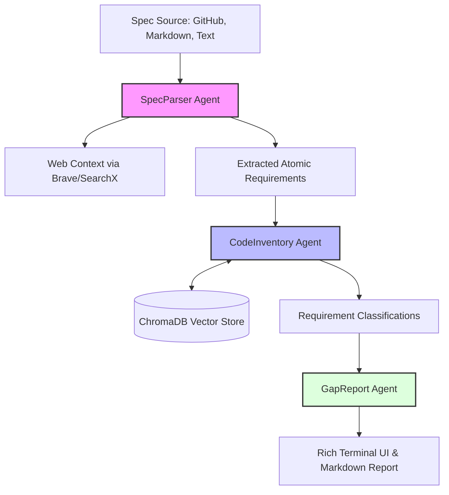

<div align="center">
  <h1>🚀 DevAgent</h1>
  <p><b>AI development agent for specification-to-code implementation.</b></p>

  <a href="https://pypi.org/project/devagent/"></a>
  <a href="https://pypi.org/project/devagent/"></a>
  <a href="https://github.com/yourusername/DevAgent/blob/main/LICENSE"></a>
  <a href="https://modelcontextprotocol.io/"></a>

  <p>
    DevAgent bridges the gap between your project specifications (GitHub Issues, Markdown specs, or plain text) and your actual codebase. It leverages local LLMs and the <a href="https://modelcontextprotocol.io/">Model Context Protocol (MCP)</a> to automate impact analysis, highlighting exactly what exists, what needs extending, and what is missing.
  </p>
</div>

---

## ✨ Features

- 🧠 **Automated Gap Analysis**: Automatically compares new specs against your existing codebase and categorizes requirements:
  - ✅ **Reuse**: Code already exists.
  - ⚠️ **Extend**: Code exists but needs modification.
  - ❌ **Conflict**: Requirement contradicts existing logic.
  - 🔨 **Net New**: Entirely new implementation required.
- 🔒 **Local & Private**: Fully supports running locally via Ollama and local ChromaDB embeddings. Your code never has to leave your machine.
- 🔌 **Model Context Protocol (MCP)**: Leverages official MCP servers to safely read your filesystem and fetch GitHub issues, alongside custom Python MCP servers for AST parsing and semantic RAG.
- ⏱️ **Effort Estimation & Planning**: Uses heuristic baselines and LLM reasoning to estimate implementation hours and suggest an optimal implementation order.
- 🎨 **Beautiful Output**: Renders beautiful Rich terminal UI interfaces and persists detailed Markdown reports for your team.

---

## 🛠️ Architecture

DevAgent uses a multi-agent LangGraph pipeline orchestrated via MCP:



---

## 🚀 Installation

DevAgent is a Python CLI tool. The recommended way to install it is via `pipx` to keep its dependencies isolated:

```bash
pipx install devagent
```

*(Alternatively, you can install it globally or in a virtual environment using `pip install devagent`)*.

### ⚠️ System Requirements
Because DevAgent utilizes official Model Context Protocol (MCP) servers under the hood, you **must have Node.js installed** on your machine.
- [Download and install Node.js](https://nodejs.org/) (Ensure `npx` is available in your PATH).

---

## ⚙️ Configuration & Setup

Before analyzing your first project, initialize the global configuration:

```bash
devagent init
```
This interactive prompt will help you set up:
- **LLM Provider**: Choose between Ollama (local), Groq, Anthropic, OpenAI, or Gemini.
- **GitHub Token**: (Optional) Required if you want DevAgent to fetch specs directly from GitHub Issues.
- **Search Provider**: (Optional) Brave or SearchX for gathering web context on implementation patterns.

*You can always view or modify your config later using `devagent config --show` or `devagent config --set key=value`.*

---

## 💻 Usage Guide: Analyzing a GitHub Issue

The most powerful way to use DevAgent is to point it directly at a GitHub Issue. It will fetch the issue description, analyze your local codebase, and tell you exactly what you need to do to implement it.

### Step 1: Add your GitHub Token
First, ensure you have set your GitHub Personal Access Token in your configuration so DevAgent can read from the GitHub API.

```bash
# You can set it interactively via 'devagent init' or directly:
devagent config --set github.token=ghp_your_token_here

# Optionally, set a default repository to save typing later
devagent config --set github.default_repo=octocat/Hello-World
```

### Step 2: Index your Local Codebase
Navigate to the root directory of the codebase on your machine and build the semantic search index. This maps your code into a local vector database.

```bash
cd /path/to/your/project
devagent index
```
*Note: DevAgent automatically respects your `.gitignore` files. You can run this command anytime your code changes to perform a fast incremental update.*

### Step 3: Run the Analysis
Pass the GitHub Issue number to the `analyze` command. DevAgent will download the issue, extract the requirements, cross-reference them with your code, and generate a gap report.

```bash
# If you set a default_repo in config:
devagent analyze --issue 42

# Or specify the repo directly:
devagent analyze --issue 42 --repo octocat/Hello-World
```

DevAgent will output a detailed, color-coded report to your terminal and save a Markdown copy (e.g., `issue-42-2026-08-09-153000.md`) in your local reports folder.

---

## 📝 Other Usage Modes

DevAgent can also analyze local files or raw text:

```bash
# Analyze a local spec file
devagent analyze --spec ./docs/new_feature.md

# Analyze inline text
devagent analyze --text "Add a new user authentication endpoint supporting OAuth2."
```

### Manage Reports
View previously generated reports for the current project:

```bash
# List all saved reports
devagent reports

# View a specific report in the terminal
devagent reports --show issue-42
```

### Semantic Search
Need to quickly find where something is implemented? Use the standalone semantic search:

```bash
devagent search "user authentication logic"
```

---

## 🩺 Troubleshooting

If you run into issues with dependencies or services, run the built-in doctor command to check the health of your environment:

```bash
devagent doctor
```

## 🤝 Contributing

Contributions are welcome! Please check out the issues page or submit a pull request.

## 📝 License

This project is licensed under the MIT License - see the [LICENSE](LICENSE) file for details.
