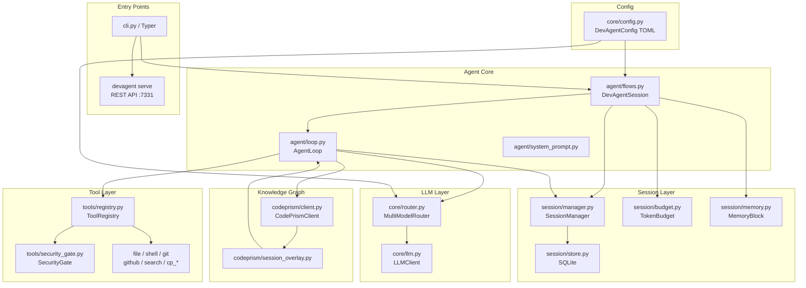

# Architecture Overview

Personal reference. Not for public distribution.

---

## Package layout

```
devagent/
├── cli.py                  # All CLI commands (Typer). Entry point.
├── agent/
│   ├── loop.py             # AgentLoop — the core ReAct engine
│   ├── flows.py            # DevAgentSession, run_implement/review/triage/fix_ci
│   └── system_prompt.py    # System prompt builder
├── core/
│   ├── config.py           # DevAgentConfig dataclasses + load/save (TOML)
│   ├── llm.py              # LLMClient, complete_with_tools, get_llm_for_task
│   ├── router.py           # MultiModelRouter — task detection + client caching
│   ├── project.py          # detect_project_root()
│   ├── storage.py          # Path helpers, SQLite init, index helpers
│   └── url_parser.py       # parse_github_url(), format_repo_string()
├── session/
│   ├── store.py            # Raw SQLite operations (sessions, events, memory)
│   ├── manager.py          # SessionManager — high-level session API
│   ├── history.py          # build_messages() — reconstruct LLM message list
│   ├── budget.py           # TokenBudget — per-model cost tracking
│   └── memory.py           # MemoryBlock — key-value fact store
├── tools/
│   ├── registry.py         # ToolRegistry — register / call / get_definitions
│   ├── security_gate.py    # SecurityGate — BLOCK / WARN / PASS on writes
│   ├── file_tools.py       # read_file, write_file, edit_file, find_files, list_files
│   ├── shell_tool.py       # run_shell (with timeout + size cap)
│   ├── git_tools.py        # git_status, git_diff, git_log, git_show, git_commit
│   ├── search_tools.py     # grep, web_search (Brave or SearchX)
│   ├── github_tools.py     # GitHub REST API calls
│   ├── codeprism_tools.py  # cp_* tools (wraps CodePrismClient)
│   └── memory_tools.py     # remember_fact, recall_facts, forget_fact
├── codeprism/
│   ├── client.py           # CodePrismClient — thin wrapper around codeprism-ai
│   └── session_overlay.py  # build_session_overlay() — injects graph facts into prompt
├── mcp/
│   ├── manager.py          # MCPManager — launches Node.js MCP servers
│   ├── client.py           # MCPClient base
│   └── clients/            # GitHubClient, BraveClient, SearchXClient, etc.
├── server/
│   └── app.py              # REST API (stdlib http.server, port 7331)
├── output/
│   ├── streaming.py        # AgentEvent → terminal renderer
│   ├── terminal.py         # Rich report rendering helpers
│   ├── chat_renderer.py
│   └── watcher_renderer.py
├── watcher/
│   ├── scheduler.py        # WatcherScheduler — async polling loop
│   ├── checker.py          # Issue checker — fetches + analyses new issues
│   ├── conflict_detector.py
│   └── storage.py          # Watcher SQLite tables
└── chat/                   # Legacy chat session (pre-agent harness)
```

---

## Component relationships



---

## Key design decisions

| Decision | Rationale |
|---|---|
| No LangChain / LangGraph | Official SDKs only — less magic, easier to debug, faster startup |
| Sync generator for agent loop | Caller (CLI) controls rendering; loop stays pure logic |
| SQLite for sessions | Zero infra, survives restarts, embeds alongside project files |
| CodePrism graph for context | 60-80% token reduction on large codebases vs. dumping raw files |
| Security gate on all writes | Agent can't accidentally write secrets or shell-injection patterns |
| Multi-model router | Use cheap models for reads, strong models only when writing code |
| Offline-first (Ollama default) | No API costs or network required for day-to-day use |

---

## Data stores

| Store | Location | Contents |
|---|---|---|
| Config TOML | `~/.config/devagent/config.toml` (Linux/macOS) `%APPDATA%\devagent\config.toml` (Windows) | LLM provider, API keys, GitHub token |
| Sessions SQLite | `<project>/.devagent/sessions.db` | Sessions, events, memory entries, token totals |
| Watcher SQLite | `~/.devagent/watcher.db` | Watched repos, analyses, conflict data |
| CodePrism graph | `<project>/.codeprism/` | AST graph, import graph, symbol index |
| Watcher reports | `~/.devagent/watcher-reports/<owner>/<repo>/` | Full gap analysis JSONs per issue |

---

## LLM providers wired up

```
ollama      → httpx → http://localhost:11434
anthropic   → anthropic SDK → api.anthropic.com
openai      → openai SDK → api.openai.com
gemini      → google-generativeai SDK → generativelanguage.googleapis.com
groq        → groq SDK → api.groq.com
```

All routed through `LLMClient.complete_with_tools()` which normalises the response into `LLMResponse(content, tool_calls, input_tokens, output_tokens)`.
