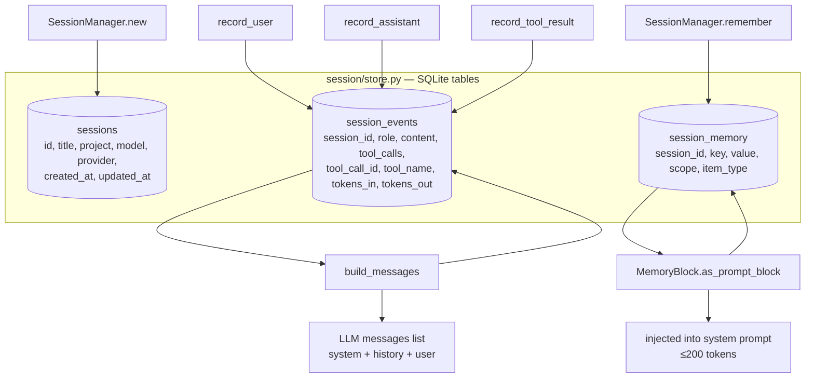
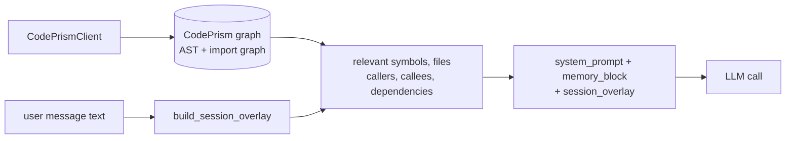
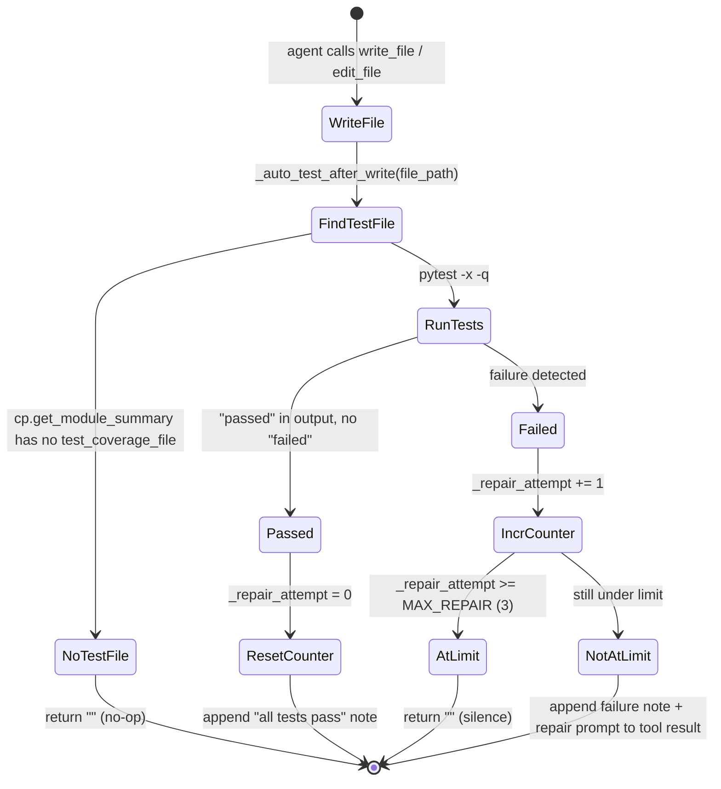

# Data Flow

How data moves through the system during a normal agent turn.

---

## End-to-end request flow

```mermaid
sequenceDiagram
    participant U as User (terminal)
    participant REPL as interactive_repl()
    participant LOOP as AgentLoop.run()
    participant HIST as session/history.py
    participant STORE as session/store.py (SQLite)
    participant MEM as MemoryBlock
    participant CP as CodePrismClient
    participant ROUTER as MultiModelRouter
    participant LLM as LLMClient
    participant REG as ToolRegistry
    participant GATE as SecurityGate
    participant TOOL as Tool handler
    participant RENDER as output/streaming.py

    U->>REPL: types message
    REPL->>STORE: record_user(session_id, message)
    REPL->>LOOP: run(user_message)

    loop ReAct iterations (max 30)
        LOOP->>MEM: as_prompt_block()
        MEM-->>LOOP: memory facts (≤200 tokens)
        LOOP->>CP: build_session_overlay()
        CP-->>LOOP: graph context (relevant symbols/files)
        LOOP->>HIST: build_messages(session_id, system_prompt)
        HIST->>STORE: get_events(session_id)
        STORE-->>HIST: event rows
        HIST-->>LOOP: [system, ...history, user] message list

        LOOP->>LOOP: budget.check() → BudgetExceeded?
        LOOP->>ROUTER: get_llm_for_iteration(last_tools, iteration)
        ROUTER-->>LOOP: (LLMClient, task_name)

        LOOP->>LLM: complete_with_tools(messages, tool_defs)
        LLM-->>LOOP: LLMResponse(content, tool_calls, tokens_in, tokens_out)

        LOOP->>LOOP: budget.record(tokens_in, tokens_out, provider, model)
        LOOP->>RENDER: StatusEvent(status_line, task, iteration)
        RENDER-->>U: live status bar update

        alt LLM returned tool calls
            LOOP->>STORE: record_assistant(content, tool_calls, tokens)
            LOOP->>RENDER: ThinkingEvent(content)
            RENDER-->>U: dim reasoning text

            loop each tool call
                LOOP->>RENDER: ToolCallEvent(id, name, args)
                RENDER-->>U: "calling tool_name..."
                LOOP->>REG: call(name, args)
                REG->>GATE: scan(args) if write tool
                GATE-->>REG: PASS / WARN / BLOCK
                REG->>TOOL: handler(args)
                TOOL-->>REG: result string
                REG-->>LOOP: result

                alt write tool (write_file / edit_file)
                    LOOP->>LOOP: _auto_test_after_write(file_path)
                    LOOP->>REG: call("run_shell", pytest command)
                    REG-->>LOOP: test output
                    LOOP->>LOOP: append test note to result
                end

                LOOP->>STORE: record_tool_result(tool_call_id, name, result)
                LOOP->>RENDER: ToolResultEvent(id, name, result, success)
                RENDER-->>U: tool result (collapsed/expanded)
            end
            Note over LOOP: loop back to next iteration
        else LLM produced final answer
            LOOP->>STORE: record_assistant(content, tokens)
            LOOP->>RENDER: FinalAnswerEvent(text, tokens_in, tokens_out)
            RENDER-->>U: final answer (Markdown rendered)
            Note over LOOP: return — turn complete
        end
    end
```

---

## Token budget data flow

```mermaid
flowchart LR
    LLM_RESP[LLMResponse\ntokens_in + tokens_out]
    RECORD[TokenBudget.record\nprovider + model]
    RATE[Rate table\n$/1M tokens per model]
    ACCUM[Accumulator\ntotal_used, cost_usd]
    CHECK[budget.check\nraises BudgetExceeded]
    STATUS[status_line\ntokens: X | cost: $Y]

    LLM_RESP --> RECORD
    RECORD --> RATE
    RATE --> ACCUM
    ACCUM --> CHECK
    ACCUM --> STATUS
```

The budget is **per session** (not per turn). It accumulates across all iterations of all turns until the session is closed or explicitly reset.

---

## Session persistence data flow



---

## CodePrism context injection flow



The overlay runs **every iteration** so the injected context stays fresh as the agent edits files. Each overlay query uses CodePrism's indexed graph — it does not re-parse source files at runtime.

---

## Write-then-test data flow (auto-repair loop)



The failure note gets appended to the tool result that the LLM sees on the next turn. This makes the LLM aware of the test failure automatically, driving it to fix the code.

---

## REST API data flow

```mermaid
flowchart LR
    CLIENT[curl / browser / AI tool]
    SERVER[devagent serve\nstdlib HTTPServer :7331]
    ROUTES{route?}
    HEALTH[/api/health\nversion string]
    STATUS[/api/status\nconfig + index state]
    SESSIONS[/api/sessions\nSessionManager.list]
    TOOLS[/api/tools\nToolRegistry.get_definitions]
    STATS[/api/graph/stats\nCodePrismClient.get_stats]
    FILES[/api/graph/files\nCodePrismClient.get_file_map]

    CLIENT -->|GET| SERVER
    SERVER --> ROUTES
    ROUTES --> HEALTH
    ROUTES --> STATUS
    ROUTES --> SESSIONS
    ROUTES --> TOOLS
    ROUTES --> STATS
    ROUTES --> FILES
```

All responses are JSON. The server is read-only — no write endpoints. CORS is open for local dev.
