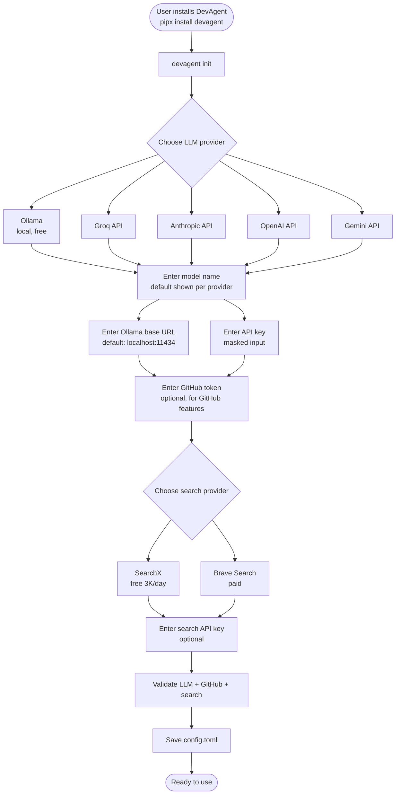
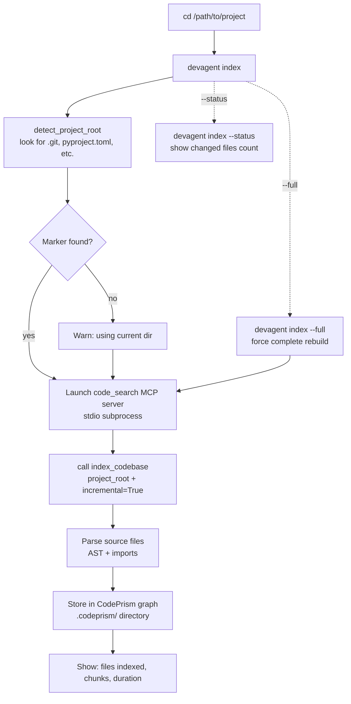
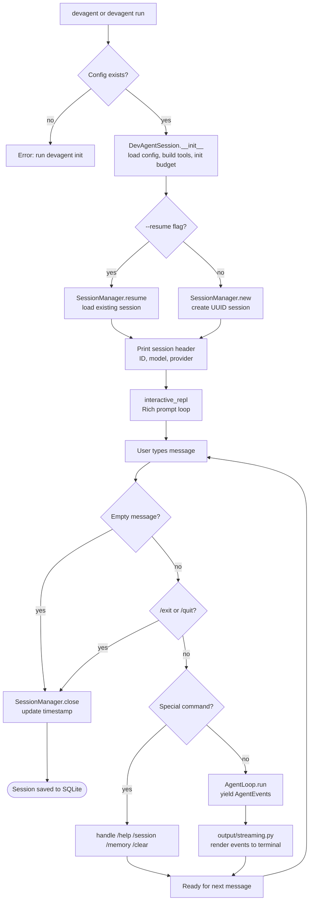
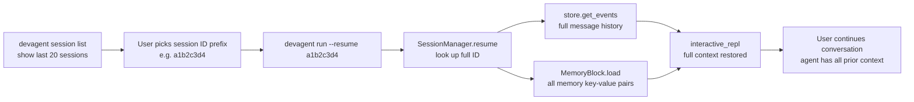
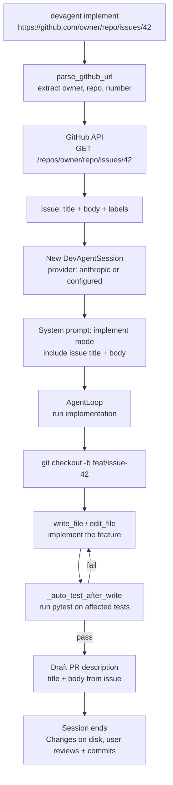
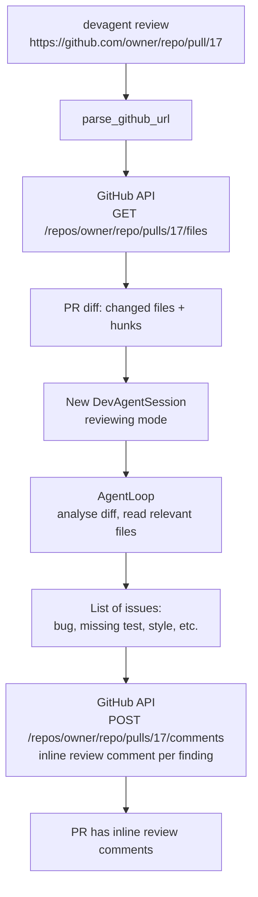
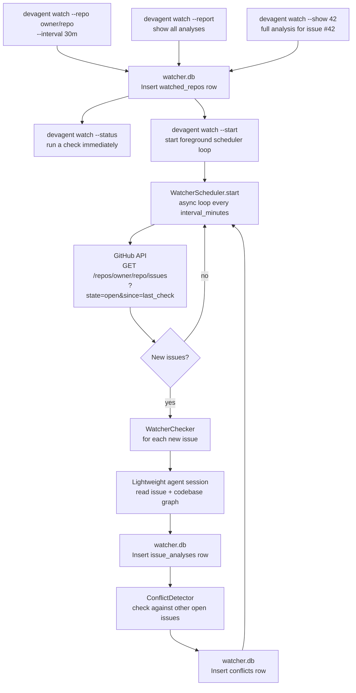
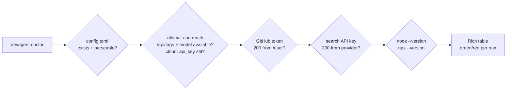

# User Flow

Every path a user takes through DevAgent, from first install to complex GitHub workflows.

---

## First-time setup

---

## Codebase indexing

**When to re-index:** After significant code changes. Incremental mode (default) only re-parses changed files. Full re-index takes the same time as the first index.

---

## Interactive session flow

---

## Session resume flow

The LLM doesn't "remember" the session — but all prior messages are replayed as context every turn via `build_messages()`. The memory block is separate: it's a compact injected prompt rather than full replay.

---

## GitHub workflow — implement an issue

---

## GitHub workflow — review a PR

---

## Background watcher flow

---

## Doctor / health check flow

