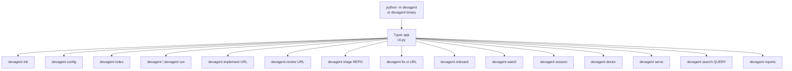
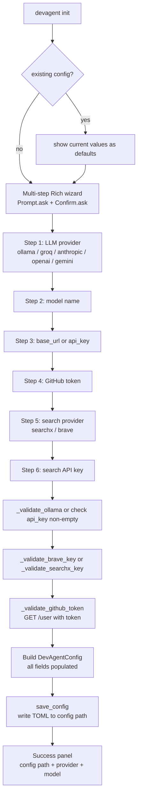
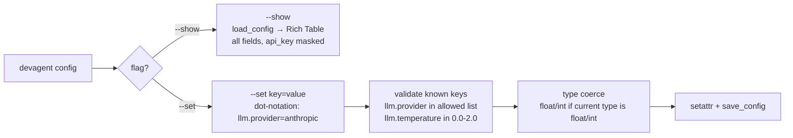
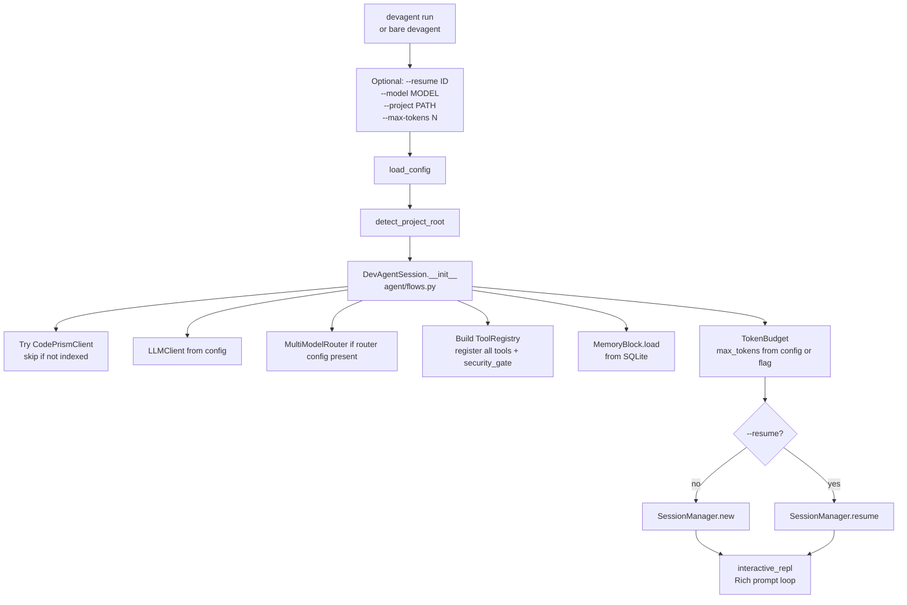
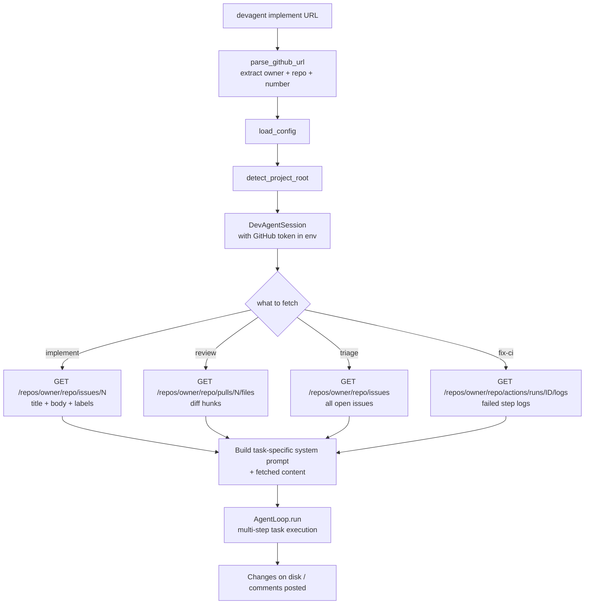
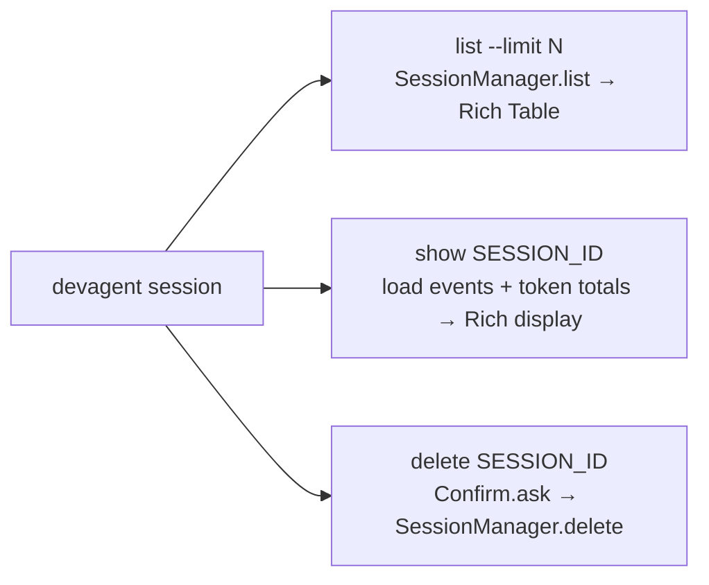
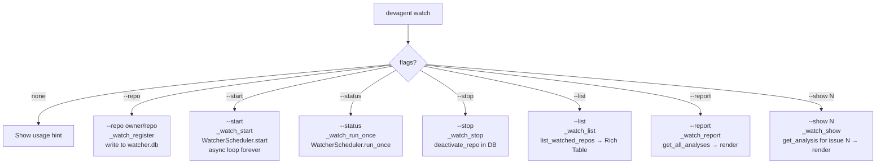
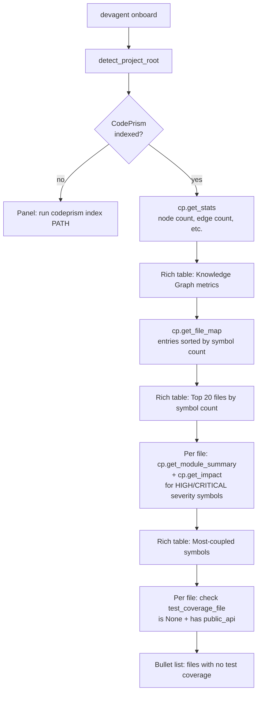

# Command Flow

How every CLI command is wired and what actually runs under the hood.

---

## Typer dispatch



---

## `devagent init`



---

## `devagent config`



---

## `devagent index`

```mermaid
flowchart TD
    INDEX_CMD[devagent index]
    FLAGS{flags?}
    STATUS_FLAG[--status\nget_index_status + get_changed_files_count]
    CLEAR_FLAG[--clear\nConfirm + clear_project_index]
    DETECT[detect_project_root\nwalk up for .git / pyproject.toml / etc]
    ENSURE[ensure_dirs\n.devagent/ + .codeprism/ structure]
    MCP_SERVER[Launch MCP server subprocess\ndevagent.mcp.servers.code_search.server]
    STDIO[stdio_client transport]
    CALL[session.call_tool\n"index_codebase"\nproject_root + incremental]
    RESULT[JSON: files_indexed, chunks_created,\nfiles_skipped, duration_seconds]
    TABLE[Show summary Rich Table]

    INDEX_CMD --> FLAGS
    FLAGS -->|--status| STATUS_FLAG
    FLAGS -->|--clear| CLEAR_FLAG
    FLAGS -->|default| DETECT
    DETECT --> ENSURE
    ENSURE --> MCP_SERVER
    MCP_SERVER --> STDIO
    STDIO --> CALL
    CALL --> RESULT
    RESULT --> TABLE
```

---

## `devagent run` (interactive session)



---

## `devagent implement / review / triage / fix-ci`

These all follow the same pattern — they differ only in the system prompt and GitHub API calls.



---

## `devagent session` sub-commands



---

## `devagent watch`



---

## `devagent serve`

```mermaid
flowchart TD
    SERVE_CMD[devagent serve\n--host 127.0.0.1\n--port 7331]
    CFG[load_config if exists\nNone otherwise]
    PROJECT[detect_project_root]
    CP[Try CodePrismClient]
    HTTP[stdlib HTTPServer\nbind host:port]
    HANDLER[RequestHandler\nparse path → dispatch]
    ROUTES{path?}
    H[/api/health → version JSON]
    S[/api/status → config + index state]
    SE[/api/sessions → last 20]
    SE_ID[/api/sessions/ID → full session]
    T[/api/tools → tool definitions]
    GS[/api/graph/stats → graph metrics]
    GF[/api/graph/files → file map]
    CORS[CORS headers on all responses]

    SERVE_CMD --> CFG --> PROJECT --> CP --> HTTP
    HTTP --> HANDLER
    HANDLER --> ROUTES
    ROUTES --> H
    ROUTES --> S
    ROUTES --> SE
    ROUTES --> SE_ID
    ROUTES --> T
    ROUTES --> GS
    ROUTES --> GF
    H --> CORS
    S --> CORS
    SE --> CORS
    T --> CORS
    GS --> CORS
    GF --> CORS
```

---

## `devagent onboard`


