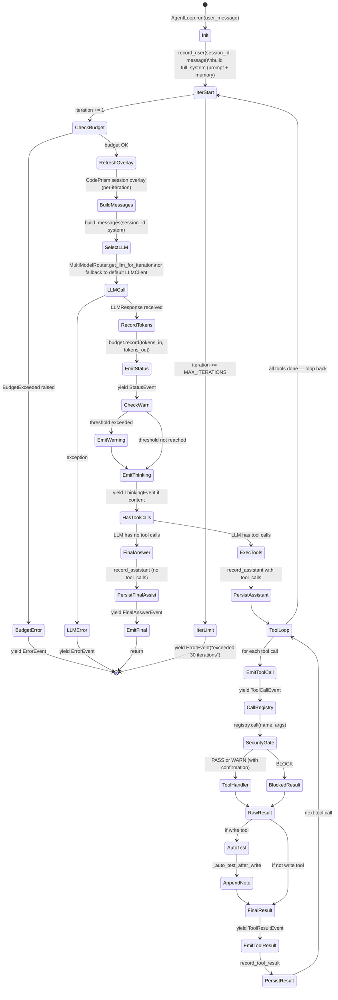
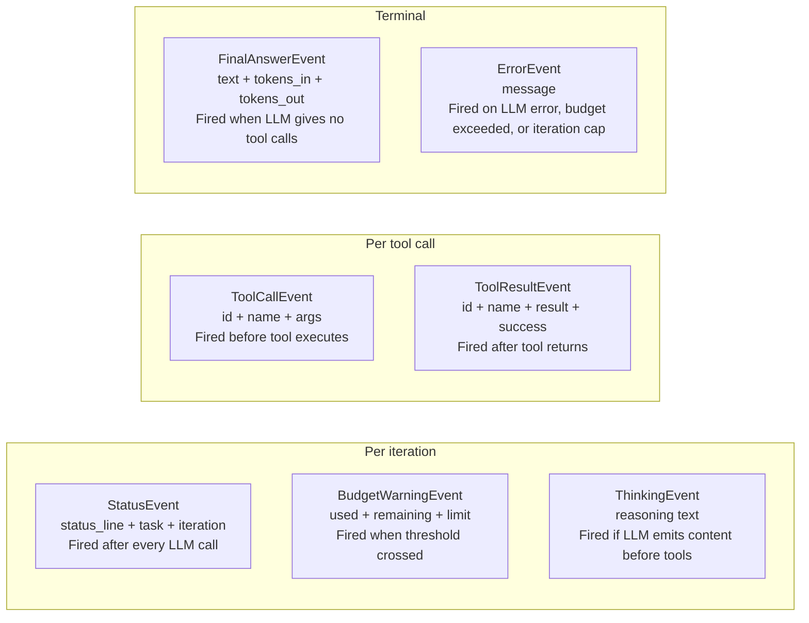

# Agent Loop Deep Dive

The ReAct engine in `devagent/agent/loop.py`.

---

## Loop constants

| Constant | Value | Meaning |
|---|---|---|
| `MAX_ITERATIONS` | 30 | Hard cap — loop exits with error if exceeded |
| `MAX_REPAIR` | 3 | Max consecutive auto-test retries after a write |
| `_WRITE_TOOL_NAMES` | `{"write_file", "edit_file"}` | Triggers auto-test repair |

---

## Full ReAct iteration state machine



---

## Event types and when they fire



The caller (`interactive_repl`) consumes these via:

```python
for event in loop.run(user_message):
    stream_event(event, console)   # output/streaming.py
```

---

## Auto-test repair loop

```mermaid
flowchart TD
    WRITE[Agent calls write_file or edit_file]
    GET_PATH[extract file_path from args]
    HAVE_CP{_cp_client is set?}
    HAVE_PATH{file_path non-empty?}
    AT_LIMIT{_repair_attempt >= MAX_REPAIR}
    SILENT[return "" — silently stop]
    GET_SUMMARY[cp.get_module_summary(file_path)]
    TEST_FILE{test_coverage_file non-empty?}
    NO_TEST[return "" — no test file to run]
    RUN_PYTEST[registry.call run_shell\npytest TEST_FILE -x -q --tb=short 2>&1]
    PASSED{"passed" in output\nand no "failed" or "error"}
    RESET[_repair_attempt = 0\nreturn "all tests pass" note]
    INC[_repair_attempt += 1]
    REMAINING{remaining > 0?}
    NOTE_CONTINUE[append failure output\n+ "N attempts remaining" prompt]
    NOTE_MAX[append "WARNING: Max repair reached"]

    WRITE --> GET_PATH
    GET_PATH --> HAVE_CP
    HAVE_CP -->|no| SILENT
    HAVE_CP -->|yes| HAVE_PATH
    HAVE_PATH -->|no| SILENT
    HAVE_PATH -->|yes| AT_LIMIT
    AT_LIMIT -->|yes| SILENT
    AT_LIMIT -->|no| GET_SUMMARY
    GET_SUMMARY --> TEST_FILE
    TEST_FILE -->|no| NO_TEST
    TEST_FILE -->|yes| RUN_PYTEST
    RUN_PYTEST --> PASSED
    PASSED -->|yes| RESET
    PASSED -->|no| INC
    INC --> REMAINING
    REMAINING -->|yes| NOTE_CONTINUE
    REMAINING -->|no| NOTE_MAX
```

The repair note is **appended to the tool result string**. This means the LLM sees "file written" + "tests failed" in one message and understands it needs to fix the code before the next tool call.

---

## MultiModelRouter selection per iteration

```mermaid
flowchart TD
    ITER[get_llm_for_iteration\nlast_tool_names + iteration]
    DETECT[detect_task\nlast_tool_names + iteration]
    FIRST{iteration == 1?}
    PLANNING[task = "planning"\nstrongest model — needs full picture]
    HAS_WRITE{last tools include\nwrite_file or edit_file?}
    CODING[task = "coding"\nprecision model]
    HAS_REVIEW{last tools include\ncp_get_impact / git_diff / git_show?}
    REVIEWING[task = "reviewing"\nreview-capable model]
    HAS_READ{last tools include\nread_file / grep / find_files / cp_*?}
    CHEAP[task = "cheap"\nsmall fast model]
    FALLBACK[task = "fallback"\ndefault fallback model]

    GET_LLM[get_llm(task)\nlook up cache → create if miss]
    CACHE{in _cache?}
    GET_LLM_FOR_TASK[get_llm_for_task(config, task)\ncreate LLMClient with task's provider + model]
    STORE_CACHE[store in _cache[task]]

    ITER --> DETECT
    DETECT --> FIRST
    FIRST -->|yes| PLANNING
    FIRST -->|no| HAS_WRITE
    HAS_WRITE -->|yes| CODING
    HAS_WRITE -->|no| HAS_REVIEW
    HAS_REVIEW -->|yes| REVIEWING
    HAS_REVIEW -->|no| HAS_READ
    HAS_READ -->|yes| CHEAP
    HAS_READ -->|no| FALLBACK

    PLANNING --> GET_LLM
    CODING --> GET_LLM
    REVIEWING --> GET_LLM
    CHEAP --> GET_LLM
    FALLBACK --> GET_LLM

    GET_LLM --> CACHE
    CACHE -->|yes| RETURN[return cached LLMClient]
    CACHE -->|no| GET_LLM_FOR_TASK
    GET_LLM_FOR_TASK --> STORE_CACHE --> RETURN
```

---

## Message construction per iteration

`build_messages()` in `session/history.py` reconstructs the full LLM message list from SQLite events each iteration:

```
[
  { role: "system",    content: system_prompt + memory_block + session_overlay },
  { role: "user",      content: "implement issue #42" },
  { role: "assistant", content: "...", tool_calls: [...] },
  { role: "tool",      content: "...", tool_call_id: "..." },
  { role: "tool",      content: "...", tool_call_id: "..." },
  { role: "assistant", content: "ok I've read the files, now I'll edit auth.py" },
  { role: "user",      content: "<next user message>" }
]
```

This is rebuilt from scratch every iteration so the system prompt overlay is always fresh (CodePrism graph reflects the latest file state).

---

## Error handling in the loop

| Scenario | Handling |
|---|---|
| LLM raises exception | `yield ErrorEvent(f"LLM error: {exc}")` → return |
| `BudgetExceeded` raised | `yield ErrorEvent(str(exc))` → return |
| Tool returns `[error] ...` | `success=False` in `ToolResultEvent`; loop continues — LLM decides what to do |
| Tool returns `[blocked] ...` (security gate) | `success=False`; LLM is informed; loop continues |
| `MAX_ITERATIONS` reached | `yield ErrorEvent("exceeded 30 iterations")` → return |
| CodePrism unavailable | `_HAS_CODEPRISM = False`; overlay step skipped silently |
| Router unavailable | Falls back to `self.llm` (the default `LLMClient`) |
