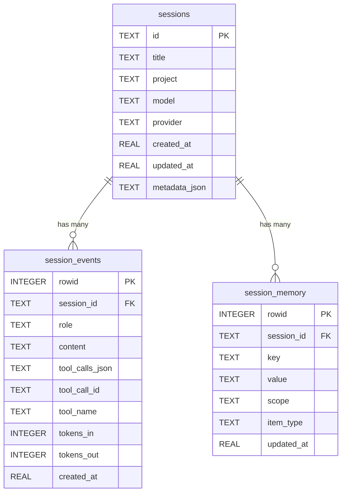
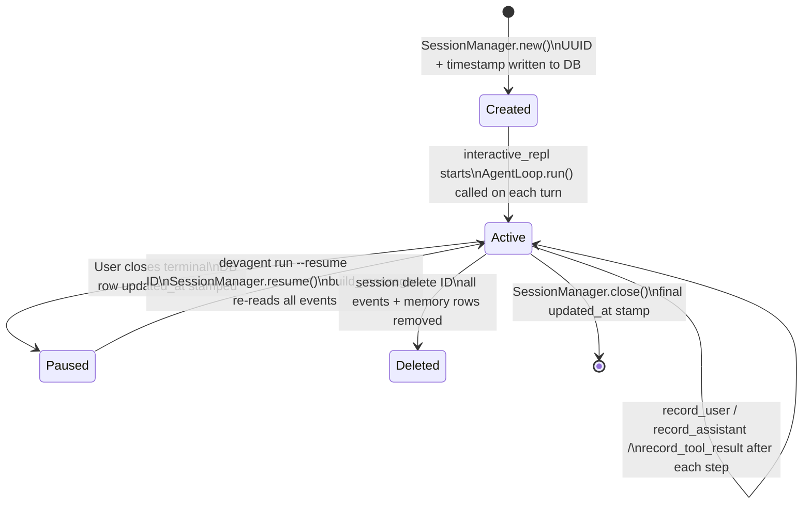
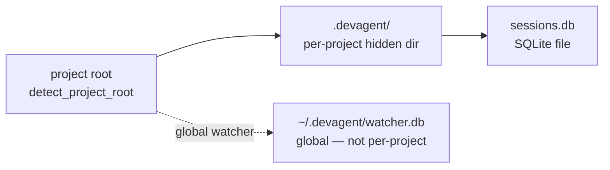

# Session Lifecycle and Memory

How sessions, events, memory, and budget are stored and restored.

---

## SQLite schema (session/store.py)



---

## Session lifecycle



---

## Event roles and what goes in each

| Role | Written by | content | extra fields |
|---|---|---|---|
| `user` | `record_user` | Raw user message text | — |
| `assistant` | `record_assistant` | LLM response text (may be empty if tool-only) | `tool_calls_json`, `tokens_in`, `tokens_out` |
| `tool_result` | `record_tool_result` | Tool return string | `tool_call_id`, `tool_name` |

`tool_calls_json` is a JSON array: `[{"id": "...", "name": "...", "args": {...}}, ...]`

---

## build_messages() reconstruction

```mermaid
flowchart TD
    EVENTS[get_events(session_id)\nORDER BY rowid ASC]
    LOOP[for each event row]
    USER_ROW{role == user?}
    ASST_ROW{role == assistant?}
    TOOL_ROW{role == tool_result?}

    USER_MSG[append user message\nrole: user, content: row.content]
    ASST_MSG{has tool_calls?}
    ASST_WITH_TOOLS[append assistant message\ncontent + tool_calls list]
    ASST_PLAIN[append assistant message\ncontent only]
    TOOL_MSG[append tool message\nrole: tool, content, tool_call_id]

    BUILD_LIST[final messages list\nfor LLM API call]

    EVENTS --> LOOP
    LOOP --> USER_ROW
    USER_ROW -->|yes| USER_MSG
    USER_ROW -->|no| ASST_ROW
    ASST_ROW -->|yes| ASST_MSG
    ASST_MSG -->|yes| ASST_WITH_TOOLS
    ASST_MSG -->|no| ASST_PLAIN
    ASST_ROW -->|no| TOOL_ROW
    TOOL_ROW -->|yes| TOOL_MSG
    USER_MSG --> BUILD_LIST
    ASST_WITH_TOOLS --> BUILD_LIST
    ASST_PLAIN --> BUILD_LIST
    TOOL_MSG --> BUILD_LIST
```

Note: the system message is prepended by the caller (`AgentLoop`) — it is not stored in the events table.

---

## MemoryBlock — key-value fact store

```mermaid
flowchart LR
    subgraph "MemoryBlock"
        CACHE[_cache dict\nin-memory]
        LOADED[_loaded flag]
    end

    subgraph "SQLite"
        MEM_TABLE[(session_memory\nkey/value/scope/item_type)]
    end

    subgraph "Agent operations"
        REMEMBER[remember_fact tool\ncall mb.set(key, value)]
        RECALL[recall_facts tool\ncall mb.all()]
        FORGET[forget_fact tool\ncall mb.delete(key)]
    end

    subgraph "Loop integration"
        PROMPT[as_prompt_block\nreturns formatted string\n≤200 tokens injected into system]
    end

    REMEMBER --> CACHE
    CACHE -->|persist| MEM_TABLE
    RECALL --> CACHE
    FORGET --> CACHE
    CACHE -->|format| PROMPT
    MEM_TABLE -->|load on first access| CACHE
```

The memory block is injected into the system prompt on every turn, not the message history. This means the LLM always has key facts available without them consuming "context slots" in the conversation thread.

**Format injected:**
```
## Session Memory
- auth_file: devagent/core/auth.py
- payment_api: uses Stripe v3
- test_runner: pytest -x -q
```

---

## TokenBudget — per-model cost tracking

```mermaid
flowchart TD
    INIT[TokenBudget.__init__\nmax_tokens: int or None\nwarn_threshold: float default 0.8]
    RECORD[budget.record\ntokens_in + tokens_out + provider + model]
    RATE_TABLE[Rate table lookup\n$/1M tokens per model\ne.g. claude-sonnet-4-6: 3.00 in / 15.00 out]
    ACCUMULATE[total_used += tokens_in + tokens_out\ncost_usd += calculated cost]
    STATUS[budget.status_line\ntokens: 14,200 | cost: $0.0213 | calls: 7]
    CHECK[budget.check\nif max_tokens and total_used >= max_tokens\nraise BudgetExceeded]
    WARN[budget.warn_threshold\ntotal_used / max_tokens >= threshold → BudgetWarningEvent]

    INIT --> RECORD
    RECORD --> RATE_TABLE
    RATE_TABLE --> ACCUMULATE
    ACCUMULATE --> STATUS
    ACCUMULATE --> CHECK
    ACCUMULATE --> WARN
```

**Key fields on TokenBudget:**
- `total_used` — cumulative input + output tokens this session
- `cost_usd` — cumulative USD cost
- `max_tokens` — hard limit (from config or `--max-tokens` flag)
- `warn_threshold` — fraction (0.0–1.0) at which to emit `BudgetWarningEvent`
- `remaining` — `max_tokens - total_used` (None if no max set)

---

## Session resume — what the LLM sees

When you resume a session with 50 prior messages, the LLM call on the first new turn looks like:

```
[system]       ← built fresh: base prompt + memory block + CodePrism overlay
[user]         ← message 1 from history
[assistant]    ← message 2 (with tool_calls if any)
[tool]         ← message 3
[tool]         ← message 4
...
[assistant]    ← last message from prior session
[user]         ← NEW: "continue where we left off"
```

This is why long sessions approach the model's context window. For very long sessions, consider a new session and copy the relevant memory facts across.

---

## Session database location



Deleting `.devagent/sessions.db` wipes all sessions for that project. The CodePrism graph lives in `.codeprism/` — separate and safe to delete + rebuild independently.
