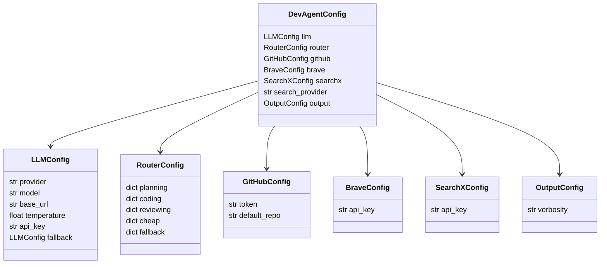

# LLM Layer and Configuration

How the LLM abstraction works, how providers are normalised, and how config flows through.

---

## LLMClient abstraction

```mermaid
flowchart TD
    subgraph "core/llm.py"
        CLIENT[LLMClient\ncfg: LLMConfig]
        METHOD[complete_with_tools\nmessages + tool_defs → LLMResponse]
        RESPONSE[LLMResponse\ncontent: str\ntool_calls: list[ToolCallRequest]\ninput_tokens: int\noutput_tokens: int\nhas_tool_calls: bool]
    end

    subgraph "Provider backends"
        OLLAMA[Ollama\nhttpx POST /api/chat\njson mode]
        ANTHROPIC[Anthropic SDK\nclient.messages.create\nwith tools=[...]]
        OPENAI[OpenAI SDK\nclient.chat.completions.create\nwith tools=[...]\ntool_choice=auto]
        GEMINI[google-generativeai SDK\nGenerativeModel.generate_content]
        GROQ[Groq SDK\nclient.chat.completions.create]
    end

    CLIENT --> METHOD
    METHOD --> OLLAMA
    METHOD --> ANTHROPIC
    METHOD --> OPENAI
    METHOD --> GEMINI
    METHOD --> GROQ
    OLLAMA --> RESPONSE
    ANTHROPIC --> RESPONSE
    OPENAI --> RESPONSE
    GEMINI --> RESPONSE
    GROQ --> RESPONSE
```

The `complete_with_tools()` method is the single interface. All provider-specific code (stream vs. non-stream, tool format differences, token field names) is hidden inside.

---

## ToolCallRequest and response normalisation

Each provider returns tool calls in a different format. `complete_with_tools` normalises them all into:

```python
@dataclass
class ToolCallRequest:
    id: str      # provider's call ID (or generated UUID for Ollama)
    name: str    # tool name
    args: dict   # parsed arguments dict
```

**Provider differences handled internally:**

| Provider | Tool format in API | Token fields |
|---|---|---|
| Anthropic | `content` array with `tool_use` blocks | `usage.input_tokens`, `usage.output_tokens` |
| OpenAI / Groq | `choices[0].message.tool_calls` | `usage.prompt_tokens`, `usage.completion_tokens` |
| Gemini | `candidates[0].content.parts` with `function_call` | `usage_metadata` |
| Ollama | `message.tool_calls` (Ollama chat format) | no native token count (estimated) |

---

## get_llm_for_task — task-to-LLM mapping

```mermaid
flowchart TD
    CALL[get_llm_for_task\nconfig + task_name]
    ROUTER{config.router\nis set?}
    GET_TASK_CFG[router.planning / coding / reviewing / cheap / fallback]
    BUILD_CFG[LLMConfig from task dict\nmerge api_key from main llm config]
    NO_ROUTER[use config.llm directly]
    CREATE[LLMClient(cfg)]
    RETURN[return LLMClient]

    CALL --> ROUTER
    ROUTER -->|yes| GET_TASK_CFG
    ROUTER -->|no| NO_ROUTER
    GET_TASK_CFG --> BUILD_CFG
    BUILD_CFG --> CREATE
    NO_ROUTER --> CREATE
    CREATE --> RETURN
```

`api_key` is always inherited from the main `config.llm.api_key` even when the router selects a different model, so you only ever store the key once.

---

## Config object hierarchy



---

## Config file location and format

**Location:**
- Linux / macOS: `~/.config/devagent/config.toml`
- Windows: `%APPDATA%\devagent\config.toml`

**Full example TOML:**

```toml
[llm]
provider    = "anthropic"
model       = "claude-sonnet-4-6"
base_url    = "http://localhost:11434"
temperature = 0.1
api_key     = "sk-ant-..."

[llm.fallback]
provider = "ollama"
model    = "qwen2.5-coder:7b"

[router]
planning  = { provider = "anthropic", model = "claude-sonnet-4-6" }
coding    = { provider = "ollama",    model = "qwen2.5-coder:7b" }
reviewing = { provider = "anthropic", model = "claude-haiku-4-5-20251001" }
cheap     = { provider = "ollama",    model = "qwen2.5-coder:7b" }
fallback  = { provider = "ollama",    model = "qwen2.5-coder:7b" }

[github]
token        = "ghp_..."
default_repo = "owner/repo"

[brave]
api_key = "BSA..."

[searchx]
api_key = ""

search_provider = "brave"

[output]
verbosity = "normal"
```

---

## Provider defaults per provider

| Provider | Default model | Key env var |
|---|---|---|
| `ollama` | `qwen2.5-coder:7b` | — (local) |
| `groq` | `llama-3.3-70b-versatile` | `GROQ_API_KEY` |
| `anthropic` | `claude-3-5-haiku-20241022` | `ANTHROPIC_API_KEY` |
| `openai` | `gpt-4o-mini` | `OPENAI_API_KEY` |
| `gemini` | `gemini-1.5-flash` | `GOOGLE_API_KEY` |

The `init` wizard writes the api_key directly to config TOML. Alternatively, set the env var — `get_llm_for_task` prefers the config value but falls back to the env var if the config key is empty.

---

## Token cost rate table (approximate — check SDK docs for exact current rates)

| Provider | Model | Input $/1M | Output $/1M |
|---|---|---|---|
| Anthropic | claude-opus-4-8 | $15.00 | $75.00 |
| Anthropic | claude-sonnet-4-6 | $3.00 | $15.00 |
| Anthropic | claude-haiku-4-5 | $0.80 | $4.00 |
| OpenAI | gpt-4o | $5.00 | $15.00 |
| OpenAI | gpt-4o-mini | $0.15 | $0.60 |
| Groq | llama-3.3-70b-versatile | $0.59 | $0.79 |
| Groq | llama-3.1-8b-instant | $0.05 | $0.08 |
| Ollama | any local model | $0.00 | $0.00 |

`TokenBudget` uses an internal rate table. Update `session/budget.py` when pricing changes.

---

## Fallback chain

When a primary provider is unavailable (connection error, rate limit):

```mermaid
flowchart LR
    PRIMARY[Primary LLM call\nconfig.llm]
    ERROR{Error?}
    FALLBACK{config.llm.fallback set?}
    FALLBACK_CALL[Retry with fallback\nLLMClient(config.llm.fallback)]
    ERROR_EVENT[yield ErrorEvent\nno retry]
    SUCCESS[LLMResponse]

    PRIMARY --> ERROR
    ERROR -->|yes| FALLBACK
    FALLBACK -->|yes| FALLBACK_CALL
    FALLBACK -->|no| ERROR_EVENT
    FALLBACK_CALL --> SUCCESS
    PRIMARY --> SUCCESS
```

Example config — primary is Anthropic, fallback is local Ollama:

```toml
[llm]
provider = "anthropic"
model    = "claude-sonnet-4-6"
api_key  = "sk-ant-..."

[llm.fallback]
provider = "ollama"
model    = "qwen2.5-coder:7b"
```
