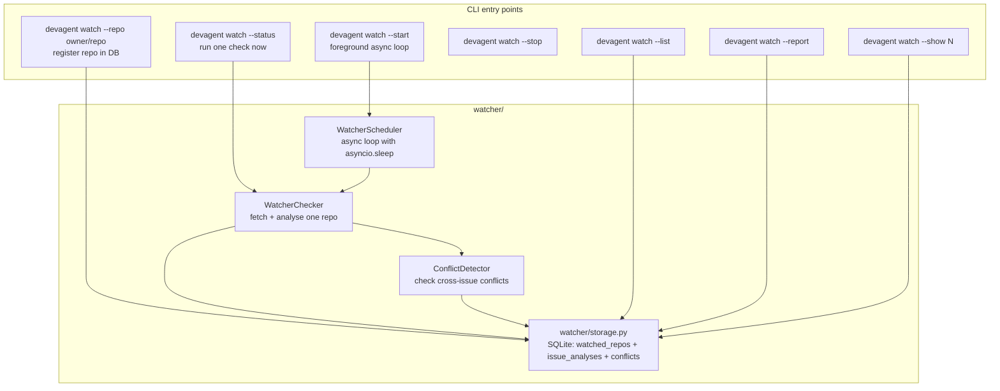
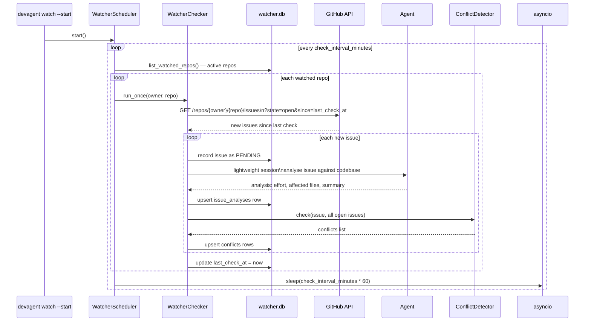
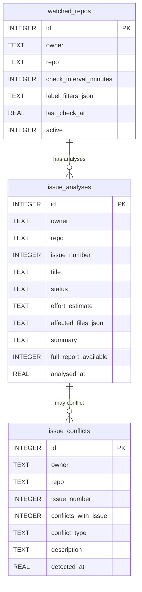
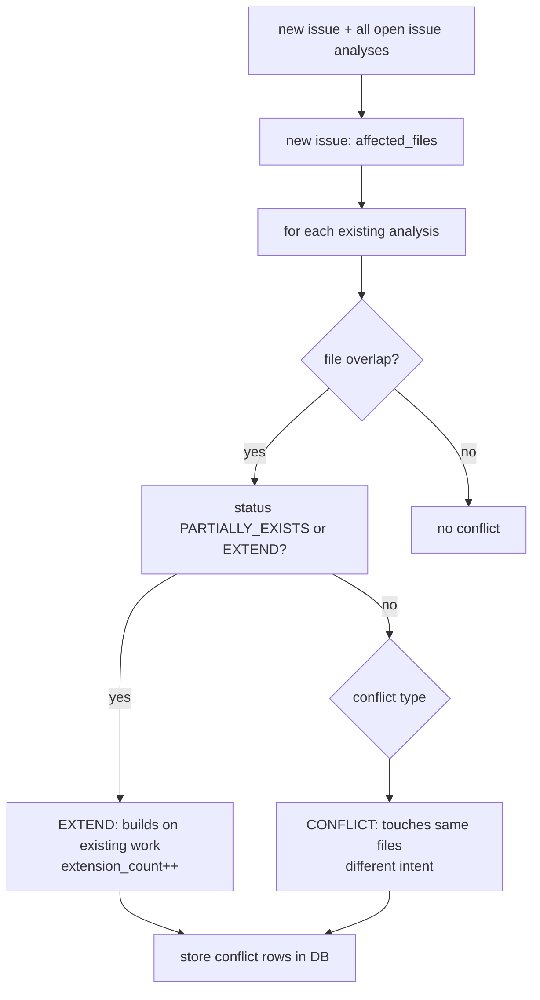

# Watcher and GitHub Integration

Background issue monitoring, conflict detection, and GitHub API flows.

---

## Watcher architecture



---

## WatcherScheduler — async polling loop



---

## Watcher SQLite schema



---

## ConflictDetector — cross-issue conflict detection



---

## GitHub API tools — detailed call map

```mermaid
flowchart LR
    subgraph "tools/github_tools.py"
        GET_ISSUE[github_get_issue\nGET /repos/owner/repo/issues/N]
        GET_PR[github_get_pr\nGET /repos/owner/repo/pulls/N\nGET /repos/owner/repo/pulls/N/files]
        LIST_ISSUES[github_list_issues\nGET /repos/owner/repo/issues\n?state=open&per_page=100]
        POST_COMMENT[github_post_comment\nPOST /repos/owner/repo/issues/N/comments]
        POST_REVIEW[github_post_review_comment\nPOST /repos/owner/repo/pulls/N/comments\n{body, path, position}]
        CREATE_PR[github_create_pr\nPOST /repos/owner/repo/pulls]
        CREATE_BRANCH[github_create_branch\nPOST /repos/owner/repo/git/refs]
        GET_CI_LOG[github_get_ci_log\nGET /repos/owner/repo/actions/runs/ID/logs]
    end

    subgraph "Authentication"
        TOKEN[GitHub token\nAuthorization: token ghp_...]
    end

    TOKEN --> GET_ISSUE
    TOKEN --> GET_PR
    TOKEN --> LIST_ISSUES
    TOKEN --> POST_COMMENT
    TOKEN --> POST_REVIEW
    TOKEN --> CREATE_PR
    TOKEN --> CREATE_BRANCH
    TOKEN --> GET_CI_LOG
```

---

## GitHub flow: `devagent review` in detail

```mermaid
sequenceDiagram
    participant USER as User
    participant CLI as cli.py
    participant FLOWS as agent/flows.py
    participant LOOP as AgentLoop
    participant GH_TOOL as github tools
    participant GH_API as GitHub API
    participant CP as CodePrismClient

    USER->>CLI: devagent review https://github.com/owner/repo/pull/17
    CLI->>FLOWS: run_review(cfg, project_root, url)
    FLOWS->>LOOP: run("Review PR #17 ...")
    LOOP->>GH_TOOL: github_get_pr(owner, repo, 17)
    GH_TOOL->>GH_API: GET /pulls/17 + GET /pulls/17/files
    GH_API-->>GH_TOOL: PR metadata + diff hunks
    GH_TOOL-->>LOOP: PR description + diff text

    loop for each changed file in diff
        LOOP->>CP: cp_get_module_summary(file_path)
        CP-->>LOOP: public API, callers, test file
        LOOP->>CP: cp_get_impact(file_path, changed_symbol)
        CP-->>LOOP: impact severity + affected surface
    end

    LOOP->>LOOP: LLM analyses diff + context\nproduces list of review findings

    loop for each finding
        LOOP->>GH_TOOL: github_post_review_comment\nowner, repo, 17, body, path, position
        GH_TOOL->>GH_API: POST /pulls/17/comments
    end

    LOOP-->>USER: "Review posted: N inline comments"
```

---

## MCP manager — server launch flow

The MCPManager in `mcp/manager.py` is used by legacy commands (`analyze`, `index`, `search`). The agent harness tools call GitHub directly — they don't go through MCP.

```mermaid
flowchart TD
    ENTER[MCPManager.__aenter__]
    CHECK_NODE[_check_node\nsubprocess node --version + npx --version]
    NODE_ERR[raise NodeNotFoundError]

    GH_ENV[set GITHUB_PERSONAL_ACCESS_TOKEN in env]
    GH_LAUNCH[npx -y @modelcontextprotocol/server-github\nStdioServerParameters]
    GH_SESSION[ClientSession.initialize]
    GH_CLIENT[GitHubClient(MCPClient(session))]

    FS_LAUNCH[npx -y @modelcontextprotocol/server-filesystem <project_root>\nStdioServerParameters]
    FS_SESSION[ClientSession.initialize]
    FS_CLIENT[FilesystemClient(MCPClient(session))]

    SEARCH_BRAVE[if brave: npx @modelcontextprotocol/server-brave-search]
    SEARCH_SX[if searchx: python -m devagent.mcp.servers.searchx.server]

    SA_LAUNCH[python -m devagent.legacy.mcp.servers.spec_analysis.server]

    EXIT_STACK[AsyncExitStack\nall transports registered]

    ENTER --> CHECK_NODE
    CHECK_NODE -->|fail| NODE_ERR
    CHECK_NODE -->|ok| GH_ENV
    GH_ENV --> GH_LAUNCH --> GH_SESSION --> GH_CLIENT
    GH_CLIENT --> FS_LAUNCH --> FS_SESSION --> FS_CLIENT
    FS_CLIENT --> SEARCH_BRAVE
    FS_CLIENT --> SEARCH_SX
    SEARCH_BRAVE --> SA_LAUNCH
    SEARCH_SX --> SA_LAUNCH
    SA_LAUNCH --> EXIT_STACK
```

Note: The agent harness phase does not use MCPManager for GitHub. It calls the GitHub REST API directly via `httpx` in `tools/github_tools.py`. MCPManager is preserved for `devagent index` and the legacy `devagent analyze` command.

---

## GitHub URL parser

`core/url_parser.py` — handles all GitHub URL shapes:

```
https://github.com/owner/repo/issues/42        → ParsedGitHubURL(owner, repo, "issue", 42)
https://github.com/owner/repo/pull/17          → ParsedGitHubURL(owner, repo, "pull_request", 17)
https://github.com/owner/repo/actions/runs/ID  → ParsedGitHubURL(owner, repo, "action_run", ID)
owner/repo                                      → just owner + repo, no number
```

`format_repo_string(parsed)` → `"owner/repo"` string.

Used everywhere a command accepts a URL argument.
