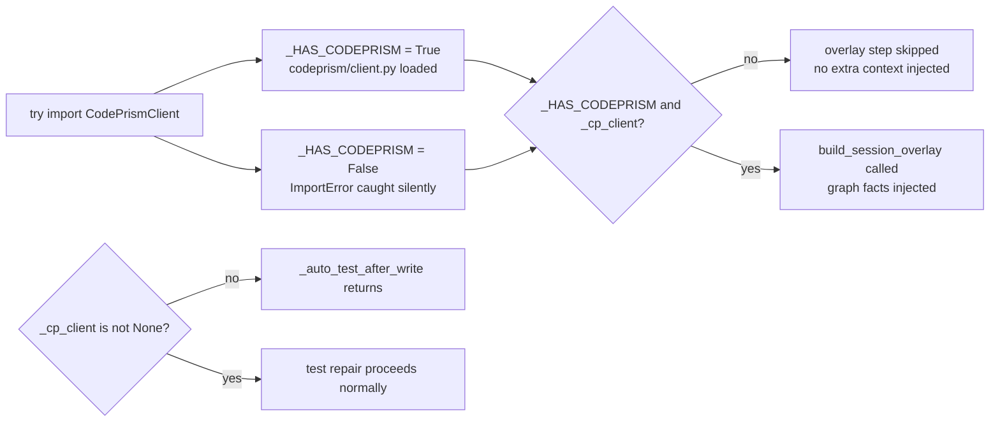

# CodePrism Integration

How the knowledge graph is queried, how context is injected, and what each graph API returns.

---

## Overview

CodePrism (`codeprism-ai` on PyPI) is a separate package that maintains a persistent AST and import graph for a project. DevAgent uses it for:

1. **Session overlay** — inject a compact summary of relevant files/symbols into the system prompt every iteration
2. **Tool calls** — the `cp_*` tools give the LLM structured access to the graph
3. **Auto-test repair** — `cp_get_module_summary` finds the test file for any source file
4. **Onboard command** — graph stats, file map, most-coupled symbols, test gaps

The graph is built by running `devagent index` (or `codeprism index <path>` directly). DevAgent connects to it via `CodePrismClient` which wraps the codeprism-ai Python API.

---

## CodePrismClient wrapper

```mermaid
flowchart LR
    subgraph "codeprism/client.py"
        CLIENT[CodePrismClient\nproject_root: str]
        IS_INDEXED[is_indexed: bool property]
        GET_STATS[get_stats → dict]
        GET_FILE_MAP[get_file_map → dict]
        GET_MODULE_SUMMARY[get_module_summary(file_path) → dict]
        GET_CONTEXT[get_context(query, top_k) → dict]
        SEARCH_SYMBOL[search_symbol(name, kind) → dict]
        GET_CALLERS[get_callers(file_path, symbol) → dict]
        GET_CALLEES[get_callees(file_path, symbol) → dict]
        GET_DEPENDENCIES[get_dependencies(file_path) → dict]
        GET_IMPACT[get_impact(file_path, symbol) → dict]
        GET_DATA_FLOW[get_data_flow(file_path, symbol) → dict]
    end

    subgraph "codeprism-ai package"
        GRAPH[(AST + import graph\n.codeprism/ directory)]
    end

    CLIENT --> GRAPH
```

All methods return a `dict`. On error they return `{"error": "..."}`. The `cp_*` tools in `tools/codeprism_tools.py` format these dicts into readable strings before returning them to the LLM.

---

## Session overlay — what gets injected

`codeprism/session_overlay.py` — called on every loop iteration:

```mermaid
flowchart TD
    OVERLAY[build_session_overlay(cp_client)]
    STATS[cp.get_stats\nnode count, edge count]
    FILE_MAP[cp.get_file_map\ntop 10 files by symbol count]
    FORMAT[Format as compact prompt block\n≈300-500 tokens]
    INJECT[Appended to system_prompt\nbefore each LLM call]

    OVERLAY --> STATS
    OVERLAY --> FILE_MAP
    STATS --> FORMAT
    FILE_MAP --> FORMAT
    FORMAT --> INJECT
```

**Example overlay output injected into the system prompt:**
```
## Codebase Graph (live)
Nodes: 1,247  Edges: 3,892  Files: 89

Key files by symbol count:
- devagent/agent/loop.py (18 symbols, role: core)
- devagent/tools/registry.py (12 symbols, role: registry)
- devagent/session/store.py (9 symbols, role: persistence)
- devagent/core/llm.py (8 symbols, role: llm_client)
...
```

This overlay costs tokens every call but saves far more by letting the LLM navigate precisely to the right file without reading everything.

---

## get_module_summary — most used API call

Used by:
- `_auto_test_after_write` — find test file after every write
- `cp_get_module_summary` tool — LLM can query manually
- `devagent onboard` — build the coupled symbols + test gap tables

**Response shape:**
```json
{
  "file": "devagent/tools/registry.py",
  "role": "registry",
  "imports": ["devagent.core.config", "dataclasses"],
  "public_api": [
    { "name": "ToolRegistry", "kind": "class", "line": 12, "is_public": true },
    { "name": "register", "kind": "method", "line": 20, "is_public": true }
  ],
  "test_coverage_file": "tests/test_tool_registry.py",
  "symbol_count": 12
}
```

---

## get_impact — change impact analysis

Used by:
- `cp_get_impact` tool — LLM queries before deciding to change a function
- `devagent onboard` — identify most-coupled symbols

**Response shape:**
```json
{
  "file": "devagent/core/llm.py",
  "symbol": "LLMClient",
  "severity": "HIGH",
  "direct_dependents": 8,
  "transitive_dependents": 23,
  "estimated_change_surface": 31,
  "public_api_affected": true,
  "affected_files": ["devagent/agent/loop.py", "devagent/core/router.py", ...]
}
```

Severity levels: `LOW`, `MEDIUM`, `HIGH`, `CRITICAL`.

---

## Graph index files (what's stored)

```
<project>/.codeprism/
├── graph.db         ← SQLite: nodes (symbols), edges (calls/imports/extends)
├── embeddings/      ← Vector embeddings for semantic context queries
└── meta.json        ← last_indexed_at, file hashes for incremental updates
```

The embeddings are used by `get_context(query)` — it does a vector similarity search to find code most relevant to the query string. Everything else uses the structural graph.

---

## When CodePrism is not available

The `_HAS_CODEPRISM` flag in `agent/loop.py` handles the case where `codeprism-ai` is not installed or the project is not indexed:



DevAgent works without CodePrism — it just uses more tokens because it needs to read entire files rather than querying the graph.

---

## Token savings — rough estimates

| Scenario | Without CodePrism | With CodePrism |
|---|---|---|
| Reading relevant context from 10-file module | ~40K tokens (full files) | ~8K tokens (graph query + targeted reads) |
| Finding all callers of a function | run_shell + grep across repo | `cp_get_callers` → precise list |
| Finding test file for a source file | run_shell + glob search | `cp_get_module_summary` → direct |
| Understanding project structure | read multiple files | session overlay → ~400 tokens |

The 60-80% token reduction claim is realistic for projects with >30 files where naive context loading would hit the context window.
